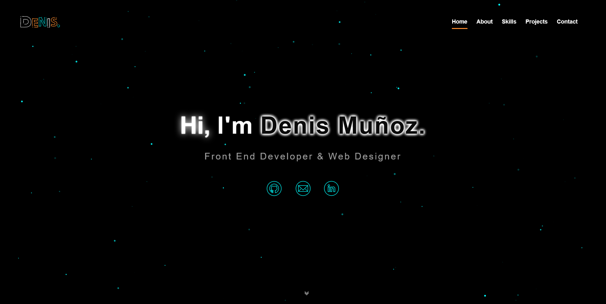

<h2>Portfolio | Denis Muñoz Baca</h2>

This is my third version on my portfolio build with html5, css, js with webpack and hosted on Github-pages

Previous versions: <a href="https://github.com/Mod8124/portfolio/blob/v1">v1</a>, <a href="https://github.com/Mod8124/portfolio/blob/v1">v2</a>

## Table of Contents

- [Table of Contents](#table-of-contents)
- [Features](#features)
- [Build With](#build-with)

## Features

Users should be able to :

-   See animation on load the page
-   See the optimal layout
-   Could download the resume
-   Change the Main colors of the page
-   onClick on projects, the user displays a modal with links to Github and URL live site

## Build With

-   JavaScript
-   CSS3
-   HTML5
-   Webpack
-   Particle.js
